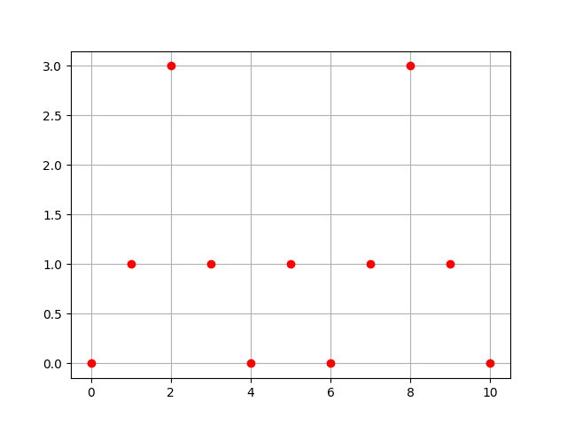

# Лекция 3

## В прошлый раз ...

Здравствуйте!

Прошлое занятие мы начали с разговора о наших ролях в процессе
изучения этого курса. Мы договорились, что я буду играть роль
представителя производства, а вы - университета.

Это логично. Вы заканчиваете бакалавриат, а мое основное место
работы - отдел аналитики и обработки данных "ИЦ Энергосервис". У нас
есть реальные задачи, а у вас - продвинутая теория, математика,
машинное обучение и все такое.

Я рассказал о наших текущих задачах, в которых требуется анализ
данных: мониторинг силовых трансформаторов, определение типов и мест
повреждений в городских распределительных сетях, анализ колебательной
устойчивости энергосистем. Эти задачи отличаются друг от друга по
масштабу. Но общим в них является то, что анализируются данные
синхронизированных векторах измерений.

Еще мы размышляли о названии курса. Его можно понимать двояко. С одной
стороны, мы можем исходить из того, что у нас есть "хорошие" данные и
на основе их анализа нам надо сказать что-то важное об объекте, к
которому относятся эти данные. Вернее, научить этому компьютер.

С другой стороны, практика такова, что в исходных данных бывает много
проблем, и вывод об объекте зачастую становится ошибочным именно из-за
проблем в данных, чему было уделено слишком мало внимания. Анализ
данных должен быть направлен в том числе и на выявление этих
проблем. Я предложил начать с этого.

В конце занятия я сделал примерно такой набросок на доске:


Я предложил представить, что это график плотности вероятности
какой-нибудь случайной величины. Например, это могло бы быть
количество одновременно наблюдаемых автомобилей на участке дороги в
течение утра, дня и вечера.

Я попросил подумать над решением такой задачи. Требуется сгенерировать
на компьютере массив случайных чисел, распределенных так, как показано
на рисунке. Каким-то похожим образом. Хорошо, если вы как-то
поделитесь с мной своими соображениями по этому поводу.

Это важная задача. Чтобы синтезировать тестовые данные, похожие на
реальные, приходится хоть сколько-то разобраться в реальном
процессе. В нашем случае реальный процесс представлен своими
статистическими характеристиками. Они могут быть даже не выявлены (мы
можем не знать формулу закона распределения и того, какие там есть
параметры), однако можно "накопить" такое распределение на основе
массива реальных данных.

## Основная часть

Сегодня я бы хотел дать подсказку по поводу решения этой задачи, а
потом, в качестве домашнего задания, немного усложнить условие.

Прежде всего, я не дал вам никаких чисел, а только набросок графика
плотности вероятности. Давайте что-то с этим сделаем. Мы можем
добавить на рисунок координатную сетку, выбрать несколько точек на
кривой, соединить их и получить массив значений "плотности
вероятности" в большем количестве точек.


В следующем листинге ниже заполняются два списка и выводится
изображение получившихся точек.

```
import matplotlib.pyplot as plt

xs = [0, 1, 2, 3, 4, 5, 6, 7, 8, 9, 10]
ys = [0, 1, 3, 1, 0, 1, 0, 1, 3, 1, 0]

plt.plot(xs, ys, "ro")
plt.grid(True)
plt.savefig("e1.png")
```

**Примечание:**. Я буду писать примеры на Python 3. Исходный код
примеров находится в папке code рядом с этими заметками.

Чтобы запустить пример на Windows, нужно в командной строке зайти в
папку **code** и выполнить команду:

```
> py e1.py
```

Результатом является следующее изображение:



<!-- Кстати, вы помните, что плотность распределения вероятности - это -->
<!-- производная функции распределения? -->

## Домашнее задание

* Накопление данных
* Распределение с пропуском посередине

## Ссылки

1. [ИЦ "Энергосервис"](https://enip2.ru/)
1. [Phasor measurement
   unit](https://en.wikipedia.org/wiki/Phasor_measurement_unit)
1. Rodionov A.V., Blinov A.N., Butin K.P., Mokeev A.V., Popov
   A.I. Practical Issues of Processing Synchrophasor Measurement Data
   in the Analysis of Low-Frequency Oscillations in Power System //
   2019 2nd International Youth Scientific and Technical Conference on
   Relay Protection and Automation (RPA), Moscow, Russia, 2019,
   pp. 1-16.
1. Blinov A.N., Rodionov A.V., Goryachevskiy I.A., Mokeev A.V., Popov
   A.I. Synchrophasor measurements application formonitoring
   transformers in step-downsubstations. // 2019 2nd International
   Youth Scientific and Technical Conference on Relay Protection and
   Automation (RPA), Moscow, Russia, 2019.
1. [Probability density
   function](https://en.wikipedia.org/wiki/Probability_density_function)
1. [Quantile
   function](https://en.wikipedia.org/wiki/Quantile_function)
1. [random — Generate pseudo-random
   numbers](https://docs.python.org/3/library/random.html)
