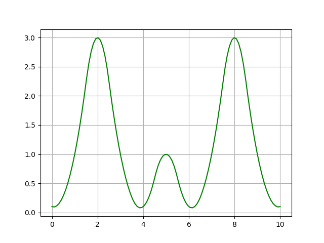
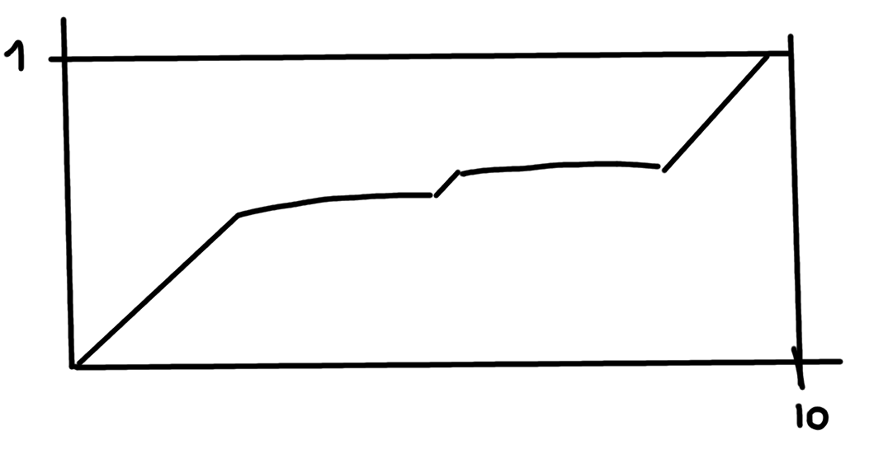
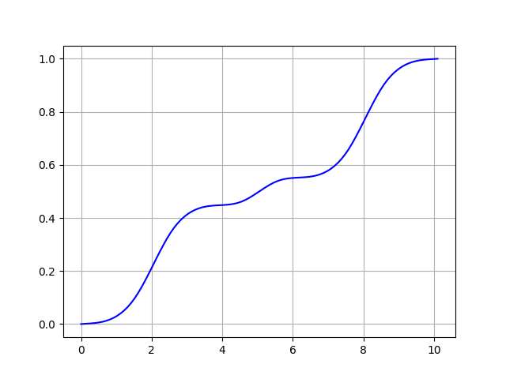

# Лекция 3

## В прошлый раз ...

Здравствуйте!

Прошлое занятие мы начали с разговора о наших ролях в процессе
изучения этого курса. Мы договорились, что я буду играть роль
представителя производства, а вы - университета.

Это логично. Вы заканчиваете бакалавриат, а мое основное место
работы - отдел аналитики и обработки данных "ИЦ Энергосервис". У нас
есть реальные задачи, а у вас - продвинутая теория, математика,
машинное обучение и все такое.

Я рассказал о наших текущих задачах, в которых требуется анализ
данных: мониторинг силовых трансформаторов, определение типов и мест
повреждений в городских распределительных сетях, анализ колебательной
устойчивости энергосистем. Эти задачи отличаются друг от друга по
масштабу. Но общим в них является то, что анализируются данные
синхронизированных векторах измерений.

Еще мы размышляли о названии курса. Его можно понимать двояко. С одной
стороны, мы можем исходить из того, что у нас есть "хорошие" данные и
на основе их анализа нам надо сказать что-то важное об объекте, к
которому относятся эти данные. Вернее, научить этому компьютер.

С другой стороны, практика такова, что в исходных данных бывает много
проблем, и вывод об объекте зачастую становится ошибочным именно из-за
проблем в данных, чему было уделено слишком мало внимания. Анализ
данных должен быть направлен в том числе и на выявление этих
проблем. Я предложил начать с этого.

В конце занятия я сделал примерно такой набросок на доске:


Я предложил представить, что это график плотности вероятности
какой-нибудь случайной величины. Например, это могло бы быть
количество одновременно наблюдаемых автомобилей на участке дороги в
течение утра, дня и вечера.

Я попросил подумать над решением такой задачи. Требуется сгенерировать
на компьютере массив случайных чисел, распределенных так, как показано
на рисунке. Каким-то похожим образом. Хорошо, если вы как-то
поделитесь с мной своими соображениями по этому поводу.

Это важная задача. Чтобы синтезировать тестовые данные, похожие на
реальные, приходится хоть сколько-то разобраться в реальном
процессе. В нашем случае реальный процесс представлен своими
статистическими характеристиками. Они могут быть даже не выявлены (мы
можем не знать формулу закона распределения и того, какие в ней есть
параметры), однако можно "накопить" такое распределение на основе
массива реальных данных.

## Основная часть

Сегодня я бы хотел дать подсказку по поводу решения этой задачи.

Прежде всего, я не предоставил вам никаких чисел, а дал только
набросок графика плотности вероятности. Давайте что-то с этим
сделаем. Мы можем добавить на рисунок координатную сетку, выбрать
несколько точек на кривой, соединить их и таким образом получить
массив значений "плотности вероятности" в большем количестве точек.


В следующем листинге на Python 3 заполняются два списка и
выводится изображение получившихся точек.

```
import matplotlib.pyplot as plt

xs = [0,   1, 2, 3, 4,   5, 6,   7, 8, 9, 10]
ys = [0.1, 1, 3, 1, 0.1, 1, 0.1, 1, 3, 1, 0.1]

fig = plt.figure()
plt.plot(xs, ys, "ro")
plt.grid(True)
plt.savefig("source.png")
plt.close(fig)
```

**Примечание:**. Мои примеры будут на Python 3. Для Python 3 есть
много хороших библиотек, связанных с анализом данных, организацией
данных, визуализацией и т.п.

Исходный код находится в папке **code** рядом с этими заметками.

Как запустить пример на Windows? Допустим, вы скачали папку **code** к
себе на компьютер. После этого нужно в командной строке зайти в папку
**code** и выполнить команду:

```
> py example.py
```

Совсем простые места в коде я не буду комментировать. Наверно ясно,
что "plot" - это рисование графика, а "savefig" - сохранение рисунка в
файл. Но я постараюсь комментировать места, относящиеся к задаче.

Результатом выполнения этой программы является следующее изображение:


Теперь надо получить значения между указанными точками. Нам надо
как-то соединить эти "опорные" точки. Добавим в наш пример
интерполяцию.

Импортируем пару пакетов (это принято писать вначале текста программы):
```
import numpy as np
from scipy.interpolate import interp1d
```

numpy делает удобной работу с массивами, а из scipy.interpolate мы
берем только одну функцию для интерполяции.

Затем:

```
f = interp1d(xs, ys, kind="quadratic")
xs = np.linspace(0, 10, 100)
ys = f(xs)

fig = plt.figure()
plt.plot(xs, ys, "g")
plt.grid(True)
plt.savefig("source-more.png")
plt.close(fig)
```



В этом фрагменте кода

```
f = interp1d(xs, ys, kind="quadratic")
```

по исходным данным получается функция f, в которой "спрятан" механизм
интерполяции.

А здесь

```
xs = np.linspace(0, 10, 100)
ys = f(xs)
```

формируется массив из 100 чисел, равномерно (линейно) расположенных от
0 до 10, и к ним применяется функция f. Так у нас получается больше
точек.

Пока мы просто "оцифровали" набросок.

А надо сгенерировать числа. Вы помните, что плотность распределения
вероятности - это производная функции распределения? Для нашей
плотности вероятности функция распределения будет выглядеть примерно
так:



Дополним наш код:

```
Ys = []
Y = 0
for y in np.array(ys) / sum(ys):
	Ys.append(Y)
	Y += y

Ys.append(1)
Xs = list(xs)
Xs.append(xs[-1] + (xs[-1] - xs[-2]))

fig = plt.figure()
plt.plot(Xs, Ys, "b")
plt.grid(True)
plt.savefig("prob.png")
plt.close(fig)
```

Здесь мы получаем функцию распределения. Каждое ее новое значение мы
получаем как сумму предыдущего значения и очередного значения
плотности вероятности, умноженного на шаг интерполирования. Т.е. мы
численно интегрируем плотность вероятности.

Последнее значение мы добавляем искусственно:
```
Ys.append(1)
Xs = list(xs)
Xs.append(xs[-1] + (xs[-1] - xs[-2]))
```

Оно должно быть равно 1.

А это `np.array(ys) / sum(ys)` нужно для того, чтобы интеграл
плотности вероятности был равен 1.

Результат соответствует нашим ожиданиям:



Следующая идея простая. Давайте посмотрим на функцию, обратную функции
распределения - так называемую квантильную функцию:


Чтобы получить этот рисунок, можно выполнить следующий код:

```
fig = plt.figure()
plt.plot(Ys, Xs, "b")
plt.grid(True)
plt.savefig("quantile.png")
plt.close(fig)
```

Я просто поменял местами переменные Xs и Ys в функции plot.

Квантильную функцию мы можем получить так:

```
Q = interp1d(Ys, Xs, kind="quadratic")
```

Здесь выполняется интерполяция при "переставленных" Xs и Ys.

Дальше мы будем генерировать случайные числа, имеющие равномерное
распределение в диапазоне от 0 до 1, и находить значения квантильной
функции от этих чисел.

Даже просто рассматривая график полученной квантильной функции можно
догадаться, что, например, при одинаковой вероятности появления
каждого из таких чисел, квантильная функция даст больше значений в
интервале от 0 до 3, чем, скажем, в интервале от 3 до 6, где она
растет быстрее.

Для генерации случайных чисел воспользуемся библиотекой random. В
начале программы надо добавить `import random`.

Сгенерируем значения:

```
vs = []
for i in range(0, 10000):
	r = random.uniform(0, 1)
	vs.append(Q(r))
```

Строим гистограмму:

```
fig = plt.figure()
plt.hist(vs, bins=50, density=True)
plt.plot(xs, ys / (sum(ys) * 10/100), "g")
plt.grid(True)
plt.savefig("hist.png")
plt.close(fig)
```

Выводим и исходную "плотность вероятности".

Результат:


Похоже, получилось то, что надо.

## Домашнее задание

* Запустить все предложенные примеры, добиться их безошибочного
  выполнения.

* Сгенерировать массив значений случайной величины, плотность
  вероятности которой строго равна нулю на некотором отрезке. Другими
  словами нужно обработать ситуацию, когда существует отрезок,
  значения из которого не встречаются никогда.

* *Подумать, о доказательстве того, что у нас действительно "получилось
  то, что надо".

## Ссылки

1. [ИЦ "Энергосервис"](https://enip2.ru/)
1. [Phasor measurement
   unit](https://en.wikipedia.org/wiki/Phasor_measurement_unit)
1. Rodionov A.V., Blinov A.N., Butin K.P., Mokeev A.V., Popov
   A.I. Practical Issues of Processing Synchrophasor Measurement Data
   in the Analysis of Low-Frequency Oscillations in Power System //
   2019 2nd International Youth Scientific and Technical Conference on
   Relay Protection and Automation (RPA), Moscow, Russia, 2019,
   pp. 1-16.
1. Blinov A.N., Rodionov A.V., Goryachevskiy I.A., Mokeev A.V., Popov
   A.I. Synchrophasor measurements application formonitoring
   transformers in step-downsubstations. // 2019 2nd International
   Youth Scientific and Technical Conference on Relay Protection and
   Automation (RPA), Moscow, Russia, 2019.
1. [Probability density
   function](https://en.wikipedia.org/wiki/Probability_density_function)
1. [Interpolation
   (scipy.interpolate)](https://docs.scipy.org/doc/scipy/reference/tutorial/interpolate.html)
1. [Quantile
   function](https://en.wikipedia.org/wiki/Quantile_function)
1. [random — Generate pseudo-random
   numbers](https://docs.python.org/3/library/random.html)
