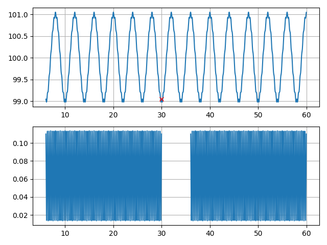
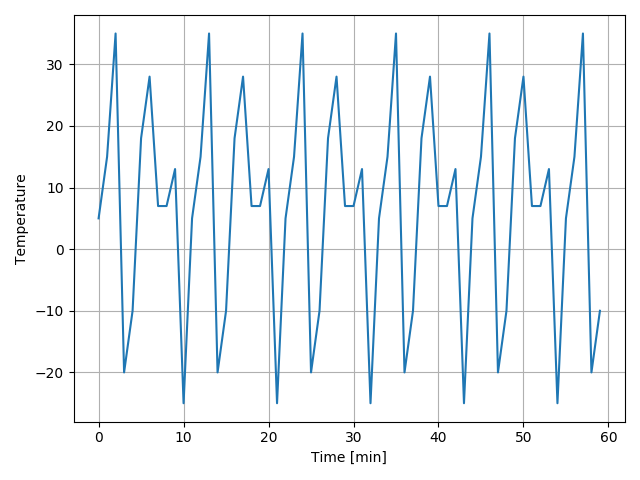
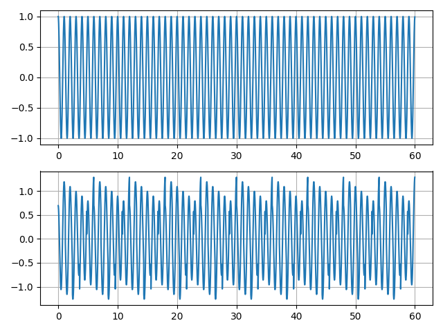

# О проблемах в данных

Здравствуйте!

Сегодня мы немного поговорим о проблеме адекватности входных
данных. Немного.

Мы, конечно, могли бы предполагать, что исходные данные для решения
какой-нибудь задачи распознавания, классификации, кластеризации и
т.п. всегда являются достаточно качественными. Но на практике это не
так. И если бы только это...

Я хочу показать некоторые "пакости", время от времени попадающиеся в
данных и приводящие иногда к очень большим проблемам на уровне
принятия решений, если мы не обращаем на них внимания. Причем я
специально беру очень простые данные, очень простую обработку и очень
простые ситуации. В качестве домашнего задания я предложу вам самим
найти больше примеров, в том числе, при помощи собственной фантазии.

Исходный код моих примеров вы найдете в файле **example.py**. Не стоит
оценивать этот код с точки зрения проектирования программных систем. В
этом смысле он далеко не образцовый.

Данные, о которых я говорил на первой лекции, возникают в результате
измерений. Измерения выполняются при помощи специальных технических
средств. Часто данные сопровождаются признаком качества,
валидности. Измерительное устройство в соответствии с некоторыми
правилами формирует этот признак и добавляет к данным. Если данные
отмечены как невалидные, то об их дальнейшей обработке не идет речи.

Но мы будем исходить как раз из того, что данные формально считаются
валидными (к нам такие данные), но в них содержится то, что мы можем в
ряде случаев назвать "аномалиями". Хотя, иногда это слово мне кажется
не совсем подходящим. Так или иначе, мы имеем формально валидные
данные, при внимательном рассмотрении кажущиеся странными. Проблемы
могут возникать в результате ошибок программирования, неправильного
подключения датчиков, неправильной настройки оборудования, его
поломок, износа и т.д.

*Нужно провести работу по систематизации этих проблем. Давайте сделаем
это с кем-нибудь из вас в магистратуре. Это будет хорошая и нужная
работа.*

Мы приходим к тому, что на уровне анализа данных надо решать не только
основную задачу анализа "чистеньких" данных, но и уделять большое
внимание качеству данных. К сожалению, нельзя здесь полностью доверять
уровню измерений.

## Вспомогательный код

```
import matplotlib.pyplot as plt
import numpy as np
import scipy.signal as sig


DT, FS = 0.02, 50
FILTER_LEN = 301


def synth():
	"""Return test signal."""
	freqs = [0.25, 3]
	amps = [1, 0.05]
	ts = np.arange(0, 60, DT)
	xs = amps[0] * np.cos(2*np.pi*freqs[0]*ts) + 50
	xs += amps[1] * np.cos(2*np.pi*freqs[1]*ts) + 50
	return xs, ts


def filt(xs, fband, ntaps=301):
	"""Filters signal."""
	h = sig.firwin(cutoff=fband, pass_zero=False, fs=FS, numtaps=ntaps)
	return sig.lfilter(h, [1], xs)


def run(func):
	"""Runs example with single figure output."""
	fig = plt.figure()
	func()
	plt.tight_layout()
	plt.savefig("{}.png".format(func.__name__))
	plt.close(fig)
```

Здесь

```
import matplotlib.pyplot as plt
import numpy as np
import scipy.signal as sig
```

импортируются библиотеки для рисования графиков, работы с массивами и
цифровой обработки сигналов.

Функция `synth` возвращает сигнал, представляющий собой сумму двух
гармонических составляющих с частотами 0.25 Гц и 3 Гц. Амплитуды
(размах) гармоник соответственно равны 1 и 0.05. Т.е. у
высокочастотной составляющей амплитуда во много раз меньше.

Сигнал - это функция от времени. Какая-то величина, изменяющаяся во
времени. Например, напряжение или сила тока. Или температура за
окном. Здесь мы говорим о цифровых сигналах. Т.е. мы располагаем
массивом значений величины, полученный в некоторые моменты времени.

Константы:

* `DT` - шаг дискретизации (через какое время брать очередное значение
  сигнала), измеряется в секундах.
* `FS` - частота дискретизации (сколько раз в секунду берется значение
  сигнала), измеряется в Герцах.
* `FILTER_LEN` - длина фильтра. Здесь такая длина используется во всех
  примерах, в которых требуется фильтрация.

В наших задачах фильтрация сигналов играет фундаментальную роль. Она
применяется на разных уровнях: от измерительных устройств до
анализаторов режимов работы системы.

Фильтрация изучается в цифровой обработке сигналов. Это очень обширная
тема. Здесь, в ряде примеров, я использую полосовую фильтрацию с тем,
чтобы показать в очень упрощенном виде процесс выбора из исходных
данных условно информативного компонента.

Функция `filt(xs, fband, ntaps=301)` осуществляет полосовую фильтрацию
сигнала `xs`, пропуская сигнал в полосе частот `fband`. Длина фильтра
задается аргументом `ntaps` и по умолчанию равна 301
отсчету. Используется фильтр с конечной импульсной характеристикой,
являющийся нерекурсивным - каждое выходное значение фильтра зависит от
`ntaps` последних входных значений.

Расчет коэффициентов фильтра выполняется функцией
`sig.firwin`. Название происходит от FIR (finite impulse response) и
win (window, оконный метод проектирования фильтра).

Вспомогательная функция `run` запускает пример. При этом
предполагается, что в примере строится какое-то изображение.Функция
`run` сохраняет это изображение в файл, имя которого формируется из
имени примера. В общем случае в этой функции мало ценности и
спроектирована не самым лучшим образом. Просто мне хотелось оформить
примеры как отдельные функции и не хотелось придумывать имена для
выходных файлов.

## Примеры

### Достоверный ноль

В сигнале встречается одно нулевое значение. А в остальном все хорошо.

```
xs, ts = synth()
xf = filt(xs, [2, 4], FILTER_LEN)
xs[len(xs) // 2] = 0
xfz = filt(xs, [2, 4], FILTER_LEN)

plt.subplot(311)
plt.plot(ts[FILTER_LEN:], xs[FILTER_LEN:])
plt.grid(True)

plt.subplot(312)
plt.plot(ts[FILTER_LEN:], xf[FILTER_LEN:])
plt.grid(True)

plt.subplot(313)
plt.plot(ts[FILTER_LEN:], xfz[FILTER_LEN:])
plt.grid(True)
```

Сначала я отфильтровал синтезированный сигнал, потом разместил
в середине исходного сигнала нулевое значение и отфильтровал
"испорченный" сигнал.


То, что мы видим - это реакция фильтра на импульс. Фильтр здесь
проявил себя. Вы можете об этом почитать в материалах о цифровой
обработке сигналов. Важно, что ноль - один, а реакция фильтра
продолжается некоторое время. Стукните ложкой по котелку - удар будет
коротким, а звук продолжительным. Это котелок проявит себя в ответ на
импульс.

А пример тут такой. Сигнал состоит из высокоамплитудной низкочастотной
составляющей и почти незаметной высокочастотной составляющей. Причем
эта высокочастотная составляющая считается информативной, ее мы
выделяем при фильтрации. И задача анализа может заключаться в том,
чтобы отслеживать опасное возрастание этой составляющей. И здесь мы
рискуем принять ложное решение.


### Повторяющиеся скачки

Этот ноль может быть результатом какой-то проблемы в оборудовании. В
следующем примере проблема появилась и не хочет уходить. Ничего необычного.

```
for i in range(5):
	xs[len(xs)//2 + i*50] = 0
xf = filt(xs, [2, 4], FILTER_LEN)
```


Кажется, действительно в системе развивается очень опасный процесс.


### Пропадание сигнала

Вот тут сигнал пропал на какое-то время. Может, это датчик ломается?
Или какой-то провод переламывается?

```
xs, ts = synth()
xs[len(xs)//2-300:len(xs)//2] = 0
xf = filt(xs, [2, 4], FILTER_LEN)
```


### Пропуск

В следующем примере с сигналом все в порядке, но одно значение
пропущено. Не ноль, а `None`.

```
xs, ts = synth()
n = len(xs)//2
xs[n] = None
xf = filt(xs, [2, 4], FILTER_LEN)
```

Вот результат фильтрации:



Выходное значение фильтра образуется как линейная комбинация значений
сигнала и коэффициентов фильтра. При умножении None на число
получается None и при сложении числа с None получается None. Вот
ничего и не получается до тех пор, пока None не останется достаточно
далеко позади.

А что было бы при использовании рекурсивного фильтра, когда каждое
выходное значение зависит не только от нескольких входных, но и от
нескольких предыдущих выходных? А применяются и такие фильтры.


### Странная динамика

Вот показания температуры на улице. Измерения проводились каждую
минуту. Все значения сами по себе адекватны, пропусков в данных
нет. Но температура так себя не ведет. Это было бы ужасно.

```
bs = [5, 15, 35, -20, -10, 18, 28, 7, 7, 13, -25]
ts = np.arange(0, 60, 1)
xs = []
for i in range(len(ts)):
	xs.append(bs[i % len(bs)])
```



Как отследить такое? Можно опираться на разброс и увидеть, что он
слишком большой для такого малого диапазона времени. Можно опираться и
на скорость изменения температуры, на динамику процесса.

### Слишком много отличий

Еще один пример. Два средства измерений разного качества. Один и тот
же объект измерений, один и тот же процесс. Ожидаются похожие
показания. Но мы видим такую картину. Т.е. здесь сомнения возникают в
результате рассмотрения совокупности данных.



```
ts = np.arange(0, 60, 0.02)
xs1 = np.cos(2*np.pi*1*ts)
xs2 = np.cos(2*np.pi*1*ts + 0.1)
bs = np.arange(-0.3, 0.3, 0.01)
for i in range(len(xs2)):
	xs2[i] = xs2[i] + bs[i % len(bs)]
```


### Дополнительно

На ум приходят еще несколько примеров. Я их опишу словами:

* Постоянное значение (всегда одно и то же) в "адекватном"
  диапазоне. Например, вы обрабатываете данные о частоте переменного
  тока, а она всегда равна 50 Гц. Такие данные. Это номинальное
  значение и многие люди стремятся к тому, чтобы оно и было всегда
  таким, но если вы сегодня получаете такие данные, то тут что-то не
  то.
* Все значения сами по себе неадекватные, однако если нарисовать
  график сигнала и не подписывать ось ординат, то все кажется
  нормальным. Возможно, какой-то неучтенный коэффициент создает
  проблемы.
* Для правильной интерпретации данных не хватает
  **метаданных**. Например, мы не располагаем единицами измерения, или
  они разные для разных источников данных. Так мы можем анализировать
  полную фазу напряжения, думая, что она задана в радианах, когда на
  самом деле там градусы.
* Неучтенные особенности данных. Такой пример. Сигнал содержит
  значения увеличивающегося угла. И когда угол, возрастая, достигает,
  скажем, 360 градусов, то вместо 360 используется значение 0. Потом
  это значение увеличивается, пока снова не достигнет 360
  градусов. Т.е. дело происходит в кольце. Если мы работаем с таким
  сигналом, не учитывая указанной особенности (сигнал выглядит
  скачкообразным), и выполняем, скажем, его дифференцирование
  (мгновенная частота гармонического сигнала - производная полной
  фазы), то результат будет странным.


## Задания

* Найти (придумать) другие примеры аномалий в исходных данных.
* Ознакомиться с материалами о показателях
  вариации. См. ссылки. Подумать, как можно использовать эти
  показатели для выявления аномалий в измерительном сигнале.

## Ссылки

* [Теория и практика ЦОС](http://www.dsplib.ru/)
* [Расчет КИХ-фильтра](http://www.dsplib.ru/content/filters/firwin/firwin.html)
* [Показатели
  вариации](http://edu.tltsu.ru/sites/sites_content/site216/html/media96435/lec_5.pdf)
* [Вариация
(статистика)](https://ru.wikipedia.org/wiki/%D0%92%D0%B0%D1%80%D0%B8%D0%B0%D1%86%D0%B8%D1%8F_(%D1%81%D1%82%D0%B0%D1%82%D0%B8%D1%81%D1%82%D0%B8%D0%BA%D0%B0))
* [Coefficient of
  variation](https://en.wikipedia.org/wiki/Coefficient_of_variation)
