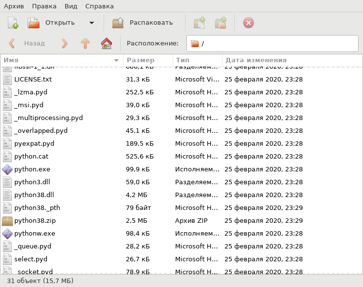
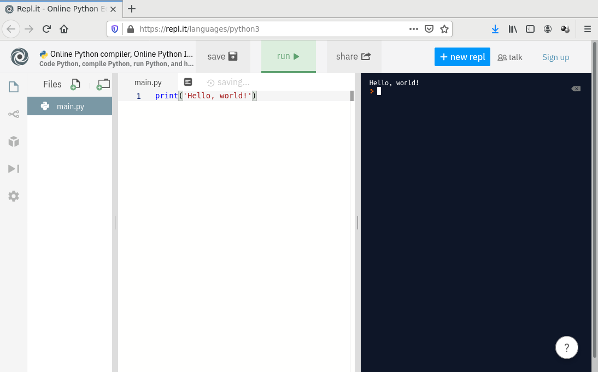
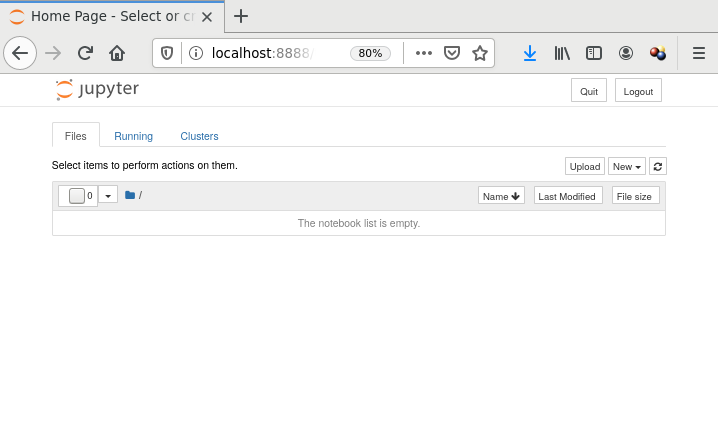

# Python 3 для анализа данных

## Введение

Здравствуйте!

Странно, но кажется, что это последняя лекция. Во всяком случае, в
расписании их больше нет. Так или иначе, у вас будет какое-то
количество практических работ, и нам надо затронуть вопрос об
инструментах.

Хорошие возможности дает владение языком программирования Python. Это
достаточно высокоуровневый язык, позволяющий взаимодействовать с
набором хороших инструментов.

Этот язык сейчас очень популярен в исследовательской работе, связанной
особенно с анализом данных. Привлекает прежде всего богатый выбор
библиотек. И, наверно, низкий порог вхождения в Python. И, вероятно,
Jupyter.

Удобно использование Python при прототипировании систем, в которых
предполагается анализ данных. Правда, иногда чрезмерное увлечение
этапом прототипирования приводит к больному вопросу: где теперь взять
реализацию всей этой математики для промышленного продукта, который
нужен почти завтра, который должен компилироваться, работать очень
быстро и который надо продать?

Конечно, Python - не единственный вариант. Из свободного есть еще,
например, R, Julia. А из дорогого и классического, например, MATLAB.

На тему использования Python для анализа данных есть очень много
материалов. Очень! С этим у вас не будет проблем.

Поэтому я здесь расскажу, как установить Python и Jupyter, как ставить
и обновлять пакеты, какие есть "классические" пакеты для анализа
данных.

Я постараюсь не писать много текста.

Можете меня дополнить или поправить, пулл-реквесты приветствуется.

## Установка Python 3

### windows


Варианты загрузки:


Вариант для установки:


Встраиваемый Python


Содержимое архива:



Допустим, вы распаковали архив в папку `D:lec\`.

Создайте там файл `hello.py` со следующим содержимым:

```
print('Hello, world!')
```

Чтобы запустить программу, выполните команду:

```
python.exe hello.py
```

### Ubuntu

```
$ sudo apt update
$ sudo apt install python3
```

### Онлайн-сервисы



## Установка пакетов

Удобно использовать pip. Принцип работы. PyPI. Ссылка.

### windows

Просто pip, без 3 на конце.

```
> pip install package_name
```

`sudo` означает выполнение действия от имени суперпользователя.

Обновление уже установленного пакета:

```
> pip install -U package_name
```

Установка в папку пользователя

```
> pip install --user package_name
```

### Ubuntu

Следует использовать команду `pip3`, если речь идет о Python 3 (скорее
всего, это так).

```
$ sudo pip3 install package_name
```

Здесь `sudo` означает выполнение действия от имени суперпользователя.

<!-- ### Виртуальное окружение, virtualenv -->

<!-- TODO -->

## Jupyter notebook

<!-- TODO: Настройка -->

Установка:

```
> pip install jupyter
```

Запуск:

```
$ cd jupyter
$ jupyter notebook
```

В браузере должна открыться вкладка:



Пример страницы:


<!-- TODO: Настройка для совместной работы -->

<!-- TODO: Я его не люблю, но иногда использую -->

## Пакеты

### Визуализация

#### matplotlib

Я всегда его использую для того, когда рисую картинки для статей и
презентаций, а также когда надо посмотреть на данные. Не упускайте
возможность посмотреть на данные.

При помощи matplotlib я обычно рисую графики сигналов во времени,
векторные диаграммы, спектры, спектрограммы, корреляционные облака,
данные в пространстве признаков и др.

Для рисования графиков в GUI приложений я обычно не использую
matplotlib, хотя это возможно. Один раз я это делал, когда писал
простое приложение для врачей, где нужна была достаточно статическая
визуализация результатов дискриминантного анализа. Но когда надо
быстро обновлять изображение, я использую другие библиотеки.

Порядок работы с matplotlib обычно такой. Сначала пишется такой испорт:

```
import matplotlib.pyplot as plt
```

Потом у `plt` мы просим рисунок:

```
fig = plt.figure(...)
```

Потом мы рисуем какие-то графики, например:

```
plt.plot([1, 2, 3], [1, 2, 1])
```

Также настраиваем оси, координатную сетку, подписи, заголовки и т.д.

В конце мы либо показываем картику:

```
plt.show()
```

либо сохраняем ее:

```
plt.savefig(...)
```

И в конце закрываем рисунок:

```
plt.close(fig)
```

Примерно так.

#### plotly

Мне недавно показал это мой коллега. Посмотрите, какие замечательные
картинки на главной странице сайта plotly:


Попробуйте plotly.

### Организация данных

В 2019 году я читал лекцию по организации данных для машинного
обучения в контексте программирования на Python. Сначала я говорил о
структурах данных, которые есть в самом языке: списках, кортежах и
словарях. Потом - о массивах numpy. Потом - о фреймах данных
pandas.

Я положил [сюда](./2019-delta/) примеры, которые я тогда
показывал. Посмотрите. Нормальный материал.

### Статистика

[**scipy.stats**](https://docs.scipy.org/doc/scipy/reference/stats.html)

Часть пакета **scipy**, имеющего более широкое назначение.

Категории функций:

* Continuous distributions
* Discrete distributions
* Summary statistics
* Frequency statistics
* Correlation functions
* Statistical tests
* Transformations
* Statistical distances
* Random variate generation
* Circular statistical functions
* Contingency table functions
* и др.

### Машинное обучение

[**scikit-learn**](https://scikit-learn.org/stable/index.html).

Разделы:

* Classification
* Regression
* Clustering
* Dimensionality reduction
* Model selection
* Preprocessing

<!-- TODO: наборы данных -->

## Другие инструменты с API для Python

[**tensorflow**](https://www.tensorflow.org/)

<!-- TODO пристроить куда-нибудь: -->
<!-- Перенесение кода на низкий уровень, реализация на другом языке -->
<!-- программирования. -->

<!-- Ограничения подхода. Потребность частых вызовов какой-нибудь -->
<!-- функции. Часто это происходит в обработке сигналов. Не выигрыш, а -->
<!-- проигрыш. -->

## Ссылки

* [Python](https://www.python.org/)
* [Online Python](https://repl.it/languages/python3)
* [Python. Урок 16. Установка пакетов в
  Python](https://devpractice.ru/python-lesson-16-install-packages/)
* [Виртуальная среда Python –
  Основы](https://python-scripts.com/virtualenv)
* [Обработка данных](https://pythonworld.ru/obrabotka-dannyx)
* [Анализ данных с использованием
  Python](https://habr.com/ru/post/353050/)
* [Matplotlib: Visualization with Python](https://matplotlib.org/)
* [Plotly Python Open Source Graphing
  Library](https://plotly.com/python/)
* [Statistical functions
  (scipy.stats)](https://docs.scipy.org/doc/scipy/reference/stats.html)
* [scikit-learn. Machine Learning in
  Python](https://scikit-learn.org/stable/index.html)
* [PyBrain работаем с нейронными сетями на
  Python](https://habr.com/ru/post/148407/)
* [Основы анализа данных на python с использованием
  pandas+sklearn](https://habr.com/ru/post/202090/)
* [An end-to-end open source machine learning
  platform](https://www.tensorflow.org/)
* [Введение в машинное обучение с
  tensorflow](https://habr.com/ru/post/326650/)
* [Сравнение программ глубинного
  обучения](https://ru.wikipedia.org/wiki/%D0%A1%D1%80%D0%B0%D0%B2%D0%BD%D0%B5%D0%BD%D0%B8%D0%B5_%D0%BF%D1%80%D0%BE%D0%B3%D1%80%D0%B0%D0%BC%D0%BC_%D0%B3%D0%BB%D1%83%D0%B1%D0%B8%D0%BD%D0%BD%D0%BE%D0%B3%D0%BE_%D0%BE%D0%B1%D1%83%D1%87%D0%B5%D0%BD%D0%B8%D1%8F)
* [Машинное обучение для начинающих: создание нейронных
  сетей](https://python-scripts.com/intro-to-neural-networks)
