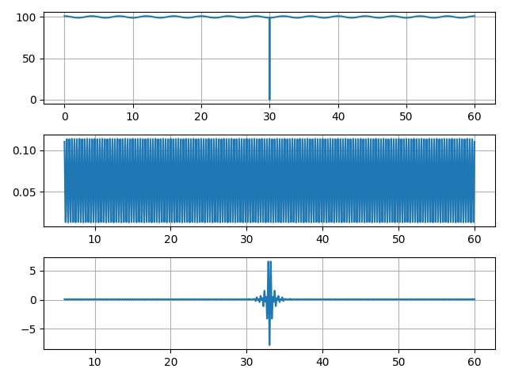
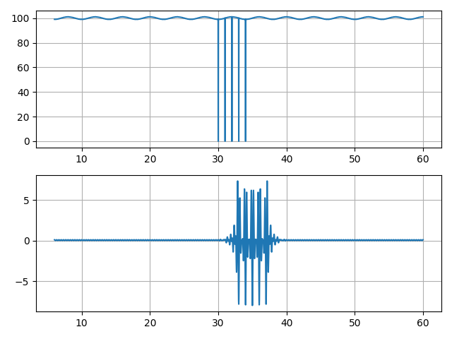
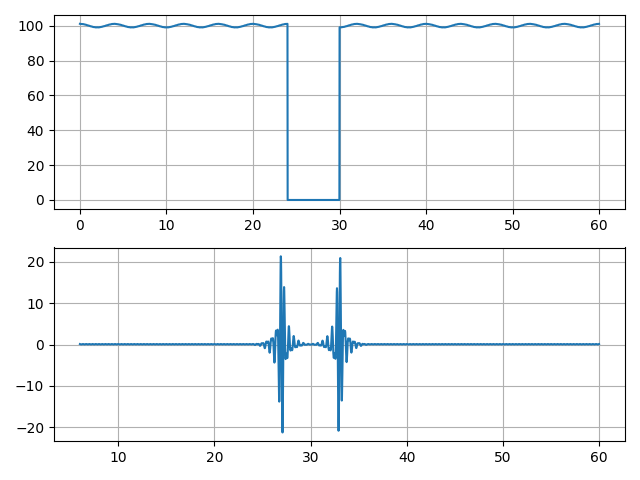
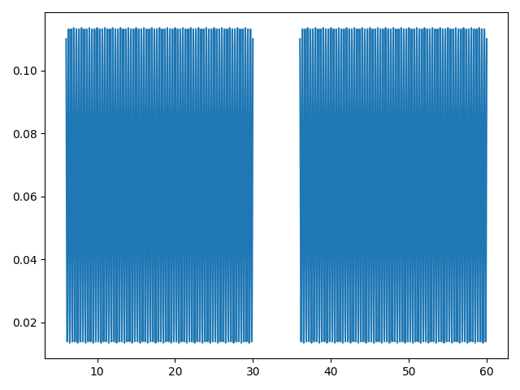
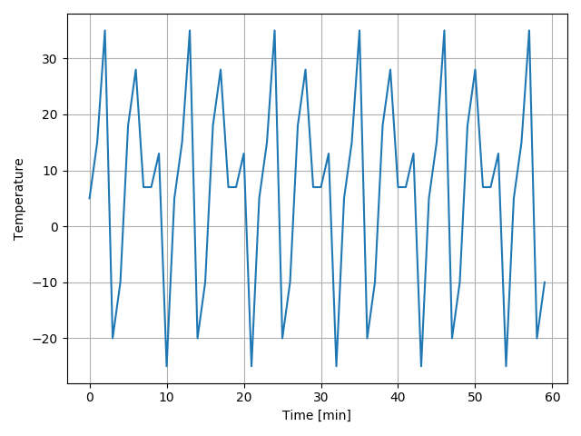
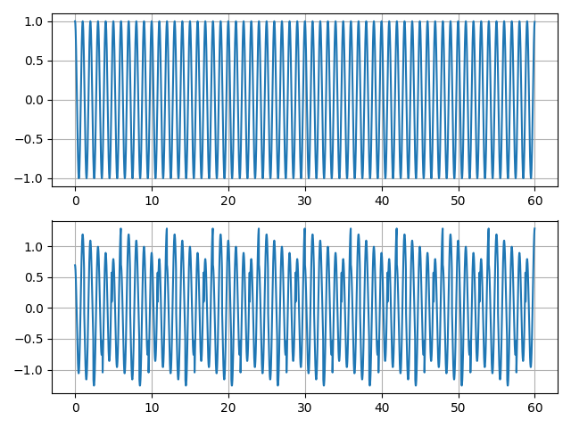

# О проблемах в данных

Здравствуйте!

Сегодня мы немного поговорим о проблеме адекватности входных
данных. Немного.

Мы, конечно, могли бы исходить из того, что исходные данные для
решения какой-нибудь задачи распознавания, классификации,
кластеризации и т.п. являются качественными. Но на практике это не
так. И если бы только это...

Я хочу показать некоторые "пакости", время от времени попадающиеся в
данных и приводящие иногда к очень большим проблемам на уровне
принятия решений. Причем я специально беру очень простые данные, очень
простую обработку и очень простые "пакости". В качестве домашнего
задания я предложу вам самим найти больше примеров, в том числе,
при помощи собственной фантазии.

Исходный код примеров вы найдете в файле **example.py**. Не стоит
оценивать этот код с точки зрения проектирования программных систем. В
этом смысле он не образцовый.

Данные, о которых я говорил на первой лекции, возникают в результате
измерений. Измерения выполняются при помощи специальных технических
средств. Часто данные сопровождаются признаком качества,
валидности. Устройство в соответствии с некоторыми правилами формирует
этот признак. Если данные отмечены как невалидные, то об их дальнейшей
обработке не идет речи.

Но мы будем исходить как раз из того, что данные формально считаются
валидными (пришли к нам такие данные - и всё тут), но в них содержится
то, что мы можем в ряде случаев назвать "аномалиями". В ряде случаев
это слово кажется не совсем подходящим. Так или иначе, мы имеем
формально валидные данные с проблемами, возникающими в результате
ошибок программирования, неправильного подключения датчиков,
неправильной настройки, поломок, износа, недостатка метаданных и т.д.

*Нужно провести работу по систематизации этих проблем. Поступайте в
магистратуру, проведем. Это будет хорошая и нужная работа.*

Мы приходим к тому, что на уровне анализа данных надо решать не только
основную задачу анализа "чистеньких" данных, но и анализировать
качество данных. К сожалению, нельзя здесь полностью доверять уровню
измерений.

## Вспомогательный код

```
import matplotlib.pyplot as plt
import numpy as np
import scipy.signal as sig


DT, FS = 0.02, 50
FILTER_LEN = 301


def synth():
	"""Return test signal."""
	freqs = [0.25, 3]
	amps = [1, 0.05]
	ts = np.arange(0, 60, DT)
	xs = amps[0] * np.cos(2*np.pi*freqs[0]*ts) + 50
	xs += amps[1] * np.cos(2*np.pi*freqs[1]*ts) + 50
	return xs, ts


def filt(xs, fband, ntaps=301):
	"""Filters signal."""
	h = sig.firwin(cutoff=fband, pass_zero=False, fs=FS, numtaps=ntaps)
	return sig.lfilter(h, [1], xs)


def run(func):
	"""Runs example with single figure output."""
	fig = plt.figure()
	func()
	plt.tight_layout()
	plt.savefig("{}.png".format(func.__name__))
	plt.close(fig)
```

Здесь

```
import matplotlib.pyplot as plt
import numpy as np
import scipy.signal as sig
```

импортируются библиотеки для рисования графиков, работы с массивами и
цифровой обработки сигналов.

Функция `synth` возвращает сигнал, представляющий собой сумму двух
гармонических составляющих с частотами 0.25 Гц и 3 Гц. Амплитуды
(размах) гармоник соответственно равны 1 и 0.05. Т.е. у
высокочастотной составляющей амплитуда намного меньше.

Константы:

* `DT` - шаг дискретизации (через какое время брать очередное значение
  сигнала), измеряется в секундах.
* `FS` - частота дискретизации (сколько раз в секунду берется значение
  сигнала), изменяется в Герцах.
* `FILTER_LEN` - длина фильтра, которая используется во всех
  приведенных примерах, где требуется фильтрация.

В наших задачах фильтрация сигналов играет фундаментальную роль. Она
применяется на разных уровнях: от измерительных устройств до
анализаторов режимов работы системы.

Фильтрация изучается в цифровой обработке сигналов. Это очень обширная
тема. Здесь, в ряде примеров, я использую полосовую фильтрацию с тем,
чтобы показать в очень упрощенном виде процесс выбора из исходных
данных условно информативного компонента.

Функция `filt(xs, fband, ntaps=301)` осуществляет полосовую фильтрацию
сигнала `xs`, пропуская сигнал в полосе частот `fband`. Длина фильтра
задается аргументом `ntaps` и по умолчанию равна 301
отсчету. Используется фильтр с конечной импульсной характеристики,
являющийся нерекурсивным - каждое выходное значение фильтра зависит от
`ntaps` последних входных значений.

Расчет коэффициентов фильтра выполняется функцией
`sig.firwin`. Название происходит от FIR (finite impulse response) и
win (window, оконный метод проектирования фильтра).

Вспомогательная функция `run` запускает пример. При этом
предполагается, что в примере строится какое-то одно изображение,
функция `run` сохраняет это изображение в файл, имя которого
формируется из имени примера. В общем случае в этой функции мало
ценности и спроектирована не самым лучшим образом. Просто мне хотелось
оформить примеры как отдельные функции и не хотелось придумывать имена
для выходных файлов.

## Примеры

### Достоверный ноль

В сигнале встречается одно нулевое значение. А в остальном все хорошо.

```
xs, ts = synth()
xf = filt(xs, [2, 4], FILTER_LEN)
xs[len(xs) // 2] = 0
xfz = filt(xs, [2, 4], FILTER_LEN)

plt.subplot(311)
plt.plot(ts[FILTER_LEN:], xs[FILTER_LEN:])
plt.grid(True)

plt.subplot(312)
plt.plot(ts[FILTER_LEN:], xf[FILTER_LEN:])
plt.grid(True)

plt.subplot(313)
plt.plot(ts[FILTER_LEN:], xfz[FILTER_LEN:])
plt.grid(True)
```

Сначала я отфильтровал синтезированный сигнал, потом разместил
середине исходного сигнала нулевое значение и отфильтровал
"испорченный" сигнал.



То, что мы видим - это реакция фильтра на импульс. Это почти как
стукнуть по арбузу. Фильтр здесь проявил себя. Вы можете об этом
почитать в материалах о цифровой обработке сигналов. Важно, что ноль -
один, а реакция фильтра продолжается некоторое время.

А пример тут такой. Сигнал состоит из высокоамплитудной низкочастотной
составляющей и почти незаметной высокочастотной составляющей. Причем
эта высокочастотная составляющая считается информативной, ее мы
выделяем при фильтрации. И задача анализа может заключаться в том,
чтобы отслеживать опасное возрастание этой составляющей. И здесь мы
рискуем принять ложное решение.

### Повторяющиеся скачки

Этот ноль может быть результатом какой-то проблемы в оборудовании. В
следующем примере проблема появилась и не хочет уходить. Ничего необычного.

```
for i in range(5):
	xs[len(xs)//2 + i*50] = 0
xf = filt(xs, [2, 4], FILTER_LEN)
```



Кажется, действительно в системе развивается очень опасный процесс.


### Пропадание сигнала

Вот тут сигнал пропал на какое-то время. Может, это датчик ломается?
Или провод?

```
xs, ts = synth()
xs[len(xs)//2-300:len(xs)//2] = 0
xf = filt(xs, [2, 4], FILTER_LEN)
```




### Пропуск

В следующем примере с сигналом все в порядке, но одно значение
пропущено. Не ноль, а None. Понимаете разницу?

```
xs, ts = synth()
n = len(xs)//2
xs[n] = None
xf = filt(xs, [2, 4], FILTER_LEN)
```

Только одно значение пропущено!

Вот результат фильтрации:



Выходное значение фильтра образуется как линейная комбинация значений
сигнала и коэффициентов фильтра. При умножении None на число
получается None и при сложении числа с None получается None. Вот
ничего и не получается до тех пор, пока None не останется достаточно
далеко позади.

А что было бы при использовании рекурсивного фильтра, когда каждое
выходное значение зависит не только от нескольких входных, но и от
нескольких предыдущих выходных? А применяются и такие фильтры.


### Странная динамика

Вот показания температуры на улице. Измерения проводились каждую
минуту. Все значения сами по себе адекватны, пропусков в данных нет.

```
bs = [5, 15, 35, -20, -10, 18, 28, 7, 7, 13, -25]
ts = np.arange(0, 60, 1)
xs = []
for i in range(len(ts)):
	xs.append(bs[i % len(bs)])
```



Как отследить такое? Можно опираться на разброс и увидеть, что он
слишком большой для такого малого диапазона времени. Можно опираться и
на скорость изменения температуры, на динамику процесса.

### Слишком много отличий

Еще один пример. Два средства измерений (разных производителей). Один
и тот же объект измерений, один и тот же процесс. Например, измеряется
температура в одном углу комнаты и в противоположном. Ожидаются
похожие показания. Но мы видим такую картину. Т.е. здесь сомнения
возникают в результате рассмотрения совокупности данных.



```
ts = np.arange(0, 60, 0.02)
xs1 = np.cos(2*np.pi*1*ts)
xs2 = np.cos(2*np.pi*1*ts + 0.1)
bs = np.arange(-0.3, 0.3, 0.01)
for i in range(len(xs2)):
	xs2[i] = xs2[i] + bs[i % len(bs)]
```


### Еще

* **TODO** постоянное значение (всегда одно и то же) в "адекватном"
  диапазоне.
* **TODO** неадекватные значения.
* **TODO** недостаточное описание (единицы измерения угла)
* **TODO** неучтенные особенности данных (угол в кольце)


## Задания

* Ознакомиться с материалами о показателях
  вариации. См. ссылки. Подумать, как можно использовать эти
  показатели для выявления аномалий в измерительном сигнале.
* Найти другие примеры аномалий в исходных данных, предложить подход к
  их распознаванию.

## Ссылки

* [Теория и практика ЦОС](http://www.dsplib.ru/)
* [Расчет КИХ-фильтра](http://www.dsplib.ru/content/filters/firwin/firwin.html)
* [Показатели
  вариации](http://edu.tltsu.ru/sites/sites_content/site216/html/media96435/lec_5.pdf)
* [Вариация
(статистика)](https://ru.wikipedia.org/wiki/%D0%92%D0%B0%D1%80%D0%B8%D0%B0%D1%86%D0%B8%D1%8F_(%D1%81%D1%82%D0%B0%D1%82%D0%B8%D1%81%D1%82%D0%B8%D0%BA%D0%B0))
* [Coefficient of
  variation](https://en.wikipedia.org/wiki/Coefficient_of_variation)
